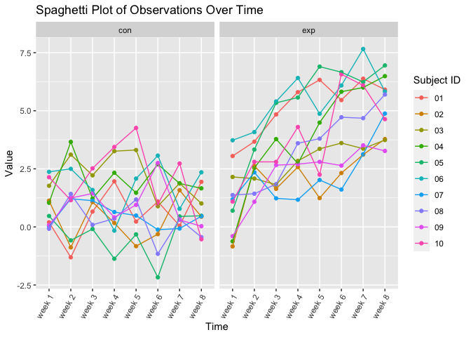
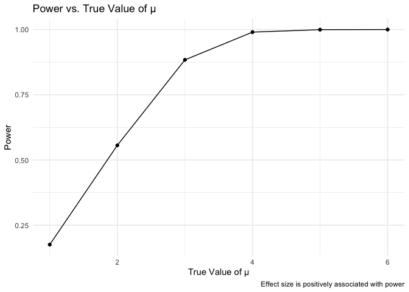

p8105_hw5_rd3097
================
2023-11-13

Necessary Library

``` r
library(tidyverse)
```

    ## ── Attaching core tidyverse packages ──────────────────────── tidyverse 2.0.0 ──
    ## ✔ dplyr     1.1.3     ✔ readr     2.1.4
    ## ✔ forcats   1.0.0     ✔ stringr   1.5.0
    ## ✔ ggplot2   3.4.4     ✔ tibble    3.2.1
    ## ✔ lubridate 1.9.3     ✔ tidyr     1.3.0
    ## ✔ purrr     1.0.2     
    ## ── Conflicts ────────────────────────────────────────── tidyverse_conflicts() ──
    ## ✖ dplyr::filter() masks stats::filter()
    ## ✖ dplyr::lag()    masks stats::lag()
    ## ℹ Use the conflicted package (<http://conflicted.r-lib.org/>) to force all conflicts to become errors

``` r
library(broom)
library(purrr)
library(ggplot2)
library(broom)
```

### Problem 1

``` r
homocide_data<-read.csv("homicide-data.csv")
```

describe the raw data

``` r
tidied_data <- homocide_data |>
  mutate(city_state =  paste(city, state, sep = ","))
disposition_data <- tidied_data|>
  group_by(city_state)|>
  summarise(
    total_homicide = sum(count = n())
  )|>
  ungroup()
unsolved_dispostion_data <- tidied_data|>
  filter(disposition %in% c("Closed without arrest", "Open/No arrest"))|>
  group_by(city_state)|>
  summarise(
    unsolved_homicide = sum(count = n())
  )|>
  ungroup()
  #since Tulsa,AL doesn't have unsolved homicide, we need to manual add it back
new_row<- tibble(city_state = "Tulsa,AL", unsolved_homicide = 0)
unsolved_disposition_new_data<- 
  rbind(unsolved_dispostion_data,new_row)
unsolved_disposition_new_data <- unsolved_disposition_new_data[order(unsolved_disposition_new_data$city_state), ]
```

``` r
baltimore_count<-disposition_data|>
  filter(city_state %in% "Baltimore,MD")
baltimore_unsolved_count<-unsolved_dispostion_data|>
  filter(city_state %in% "Baltimore,MD")
prop_test_baltimore_result <- prop.test(baltimore_unsolved_count$unsolved_homicide,
                                n = baltimore_count$total_homicide, correct = TRUE)
save(prop_test_baltimore_result, file = "prop_test_result.RData")

tidy_baltimore_test<- broom::tidy(prop_test_baltimore_result)
estimated_baltimore_proportion<- tidy_baltimore_test$estimate
confidence_baltimore_interval<- c(tidy_baltimore_test$conf.low,tidy_baltimore_test$conf.high)
```

Then run prop.test for each of the cities in your dataset, and extract
both the proportion of unsolved homicides and the confidence interval
for each.

``` r
prop_test_result <- prop.test(unsolved_disposition_new_data$unsolved_homicide,
                                n = disposition_data$total_homicide, correct = TRUE)
```

    ## Warning in prop.test(unsolved_disposition_new_data$unsolved_homicide, n =
    ## disposition_data$total_homicide, : Chi-squared approximation may be incorrect

``` r
tidy_test<- broom::tidy(prop_test_result)
```

### Problem 2

``` r
file <- list.files(path="data",pattern = "\\.csv$", full.names = TRUE)
file_names <- list.files(path = "data")
data_list <- map(file, ~ read.csv(.x),.id = "subject_name")

#tidy the data
combined_data <- bind_rows(data_list,.id = "subject_name")|>
  mutate(subject_name = file_names,
         subject_name = sub("\\.csv$", "", subject_name))|>
  separate(subject_name, c("arm", "subject_id"), sep = "_")|>
  pivot_longer(cols = starts_with("week"), 
               names_to = "Week", 
               values_to = "Observations")
time <- sub("_", " ", combined_data$Week)
tidied_data<- combined_data|>
  mutate(Week = time)
```

``` r
# make a spaghetti plot showing observations on each subject over time
ggplot(tidied_data, 
       aes(x = factor(time), y = Observations, group = subject_id, color = subject_id)) +
  geom_point() +
  geom_line() +
  facet_grid(.~arm) +
  labs(
    title = "Spaghetti Plot of Observations Over Time",
    x = "Time",
    y = "Value",
    color = "Subject ID"
  ) +
  theme(axis.text.x = element_text(angle = 60, hjust = 1))
```

<!-- -->

Based on the spaghetti graph, we can clearly see that the control arms
from the longitudinal study have lower observation values compared to
experimental arms, and the experimental arms fluctuate more frequent
than control arms.

### Problem 3

``` r
# Set parameters
n <- 30
sigma <- 5
mu <- 0
num_datasets <- 5000
alpha <- 0.05

# Function to calculate effect size (Cohen's d)
calculate_effect_size <- function(data, true_mean) {
  sample_mean <- mean(data)
  sample_sd <- sd(data)
  effect_size <- (sample_mean - true_mean) / sample_sd
  return(effect_size)
}

# Generate 5000 datasets
datasets <- matrix(rnorm(n * num_datasets, mean = mu, sd = sigma), ncol = num_datasets)

# Initialize vectors to store results
estimate_vector <- numeric(num_datasets)
p_value_vector <- numeric(num_datasets)
effect_size_vector <- numeric(num_datasets)

# Conduct one-sample t-test for each dataset and tidy the results
for (i in 1:num_datasets) {
  t_test <- t.test(datasets[, i], mu = 0)
  tidy_result <- tidy(t_test)
  
  # Save estimate, p-value, and effect size
  estimate_vector[i] <- tidy_result$estimate
  p_value_vector[i] <- as.numeric(as.character(tidy_result$p.value))
  effect_size_vector[i] <- calculate_effect_size(datasets[, i], mu)
}

# Combine the results into a data frame
results_df <- data.frame(estimate = estimate_vector,
                         p_value = p_value_vector,
                         effect_size = effect_size_vector)

# Calculate power (proportion of rejections when H0 is false)
power <- mean(results_df$p_value < alpha)

# Display the power
cat("Power:", power, "\n")
```

    ## Power: 0.0516

``` r
true_mu_values <- c(1, 2, 3, 4, 5, 6)

# Function to calculate effect size (Cohen's d)
calculate_effect_size <- function(data, true_mean) {
  sample_mean <- mean(data)
  sample_sd <- sd(data)
  effect_size <- (sample_mean - true_mean) / sample_sd
  return(effect_size)
}

# Function to conduct simulation for a given true mean
simulate_power <- function(true_mu) {
  # Generate 5000 datasets
  datasets <- matrix(rnorm(n * num_datasets, mean = true_mu, sd = sigma), ncol = num_datasets)
  
  # Initialize vectors to store results
  p_value_vector <- numeric(num_datasets)
  
  # Conduct one-sample t-test for each dataset and tidy the results
  for (i in 1:num_datasets) {
    t_test <- t.test(datasets[, i], mu = 0)
    tidy_result <- tidy(t_test)
    
    # Save p-value
    p_value_vector[i] <- as.numeric(as.character(tidy_result$p.value))
  }
  
  # Calculate power (proportion of rejections when H0 is false)
  power <- mean(p_value_vector < alpha)
  return(power)
}

# Perform simulation for each true mean
power_results <- sapply(true_mu_values, simulate_power)

# Create a plot
plot_data <- data.frame(true_mu = true_mu_values, power = power_results)
ggplot(plot_data, aes(x = true_mu, y = power)) +
  geom_line() +
  geom_point() +
  labs(title = "Power vs. True Value of μ",
       x = "True Value of μ",
       y = "Power",
       caption = "Effect size is positively associated with power") +
  theme_minimal()
```

<!-- -->
